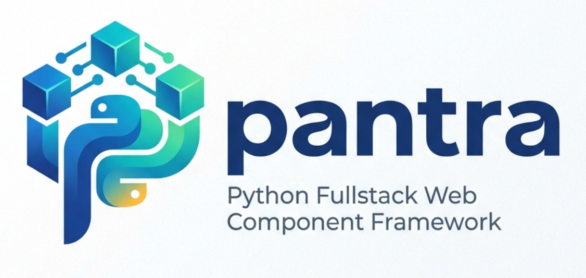

pantra documentation
=====================

Python Full-stack Framework

GitHub project: https://github.com/zergos/pantra

..  toctree::
    :maxdepth: 3
    :caption: Contents:

    concept
    structure
    components
    protocol
    js_callback
    reactive
    renderer
    template
    static
    threads
    session_tasks
    message_queue
    session_storage
    configuration
    cli
    translation
    classes
    node_classes
    ide
    debug
    cache
    database
    disclaimer
